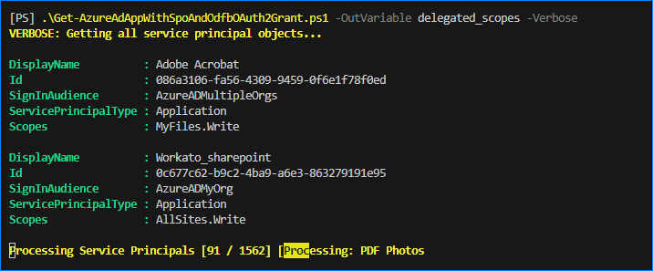
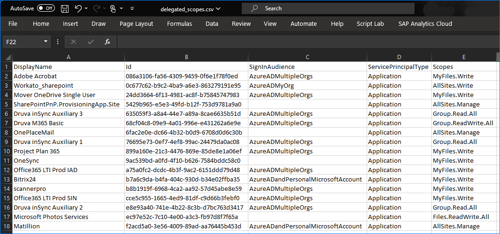

# Get-AzureAdAppWithSpoAndOdfbOAuth2Grant.ps1

This script retrieves apps with Oauth2 grants that permits delegated access to OneDrive and SharePoint items.

Targeted permissions:

| Permission           | API                 |
| -------------------- | ------------------- |
| MyFiles.Read         | SharePoint REST API |
| MyFiles.Write        | SharePoint REST API |
| AllSites.Read        | SharePoint REST API |
| AllSites.Manage      | SharePoint REST API |
| AllSites.Write       | SharePoint REST API |
| AllSites.FullControl | SharePoint REST API |
| Files.Read           | Microsoft Graph API |
| Files.ReadWrite      | Microsoft Graph API |
| Files.Read.All       | Microsoft Graph API |
| Files.ReadWrite.All  | Microsoft Graph API |
| Group.Read.All       | Microsoft Graph API |
| Group.ReadWrite.All  | Microsoft Graph API |
| Sites.Read.All       | Microsoft Graph API |
| Sites.ReadWrite.All  | Microsoft Graph API |

## Prerequisites

- [Microsoft Graph PowerShell SDK](https://learn.microsoft.com/en-us/powershell/microsoftgraph/installation) installed.
- Connected to Microsoft Graph PowerShell with `Directory.Read.All` and `Application.Read.All` scopes.

## Example 1: Get All Enterprise App Service Principals with ODfB and SPO Delegated Permissions

1. Run the script.

    ```PowerShell
    .\Get-AzureAdAppWithSpoAndOdfbOAuth2Grant.ps1 -OutVariable delegated_scopes -Verbose
    ```

    

2. Export to CSV.

    ```powerShell
    $delegated_scopes | Export-Csv -NoTypeInformation -Path .\delegated_scopes.csv
    ```

    
